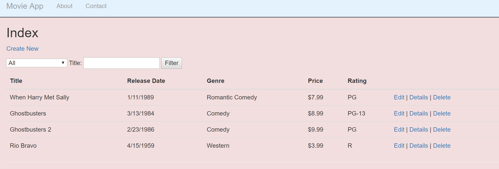

# Lab12-MVC-App-Part2
This project is from following the MVC template tutorial over on the Microsoft website. It goes over the essentials of a Model-View-Controller application using a template provided by the .NET core in Visual Studio.

It shows examples of CRUD operations with a database based for types of Movies using the Entity Framework Core. There also has been some CSS modifications to practice utilizing Bootstrap implementation.

***
## Getting starting
* Download the latest .NET SDK
* Navigate and download the project files from this repo
* You will have to setup a local database for usage so in your Package Management Console in Visual Studio use the commands:
```
Add-Migration Initial
Update-Database
```
* After running the application, if you are greeted with the below visual success! You can now browse on your local host and view the project


## What it should look like

* Landing page


* If you click on Movie App link



* The other links are also interactive and have some some small implementation of bootstrap elements on their views


***
## Resources
* [Microsoft MVC tutorial](https://docs.microsoft.com/en-us/aspnet/core/tutorials/first-mvc-app/start-mvc?view=aspnetcore-2.1&tabs=aspnetcore2x)
***
